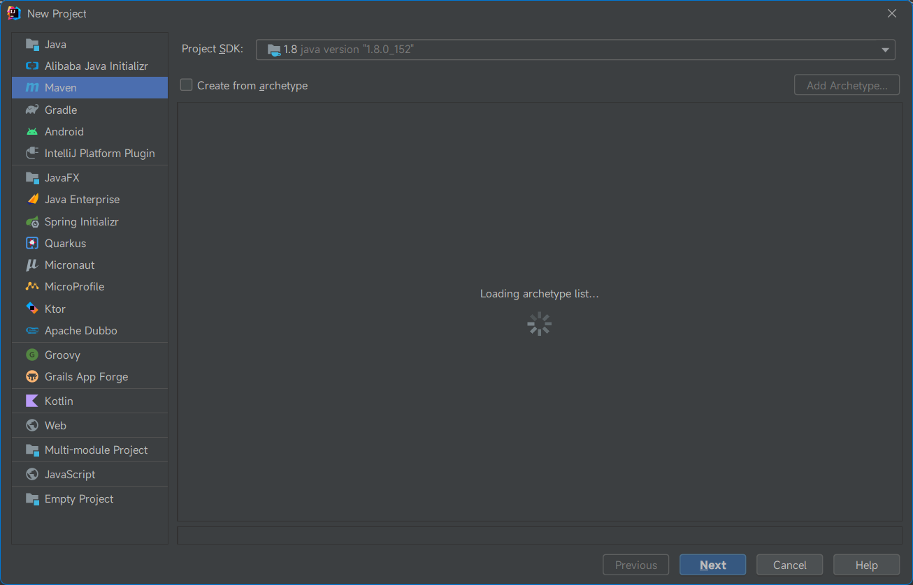
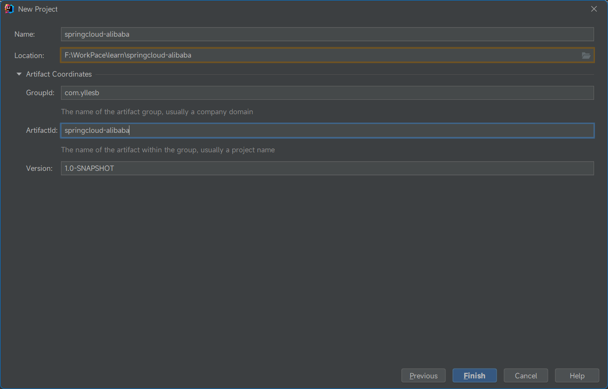
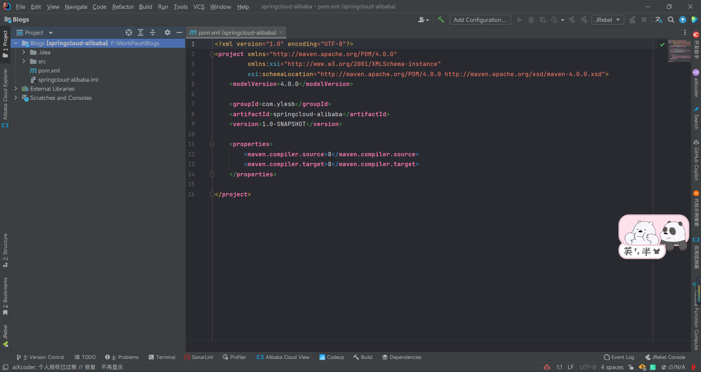
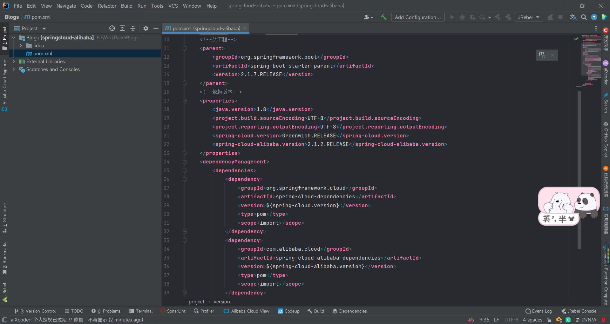
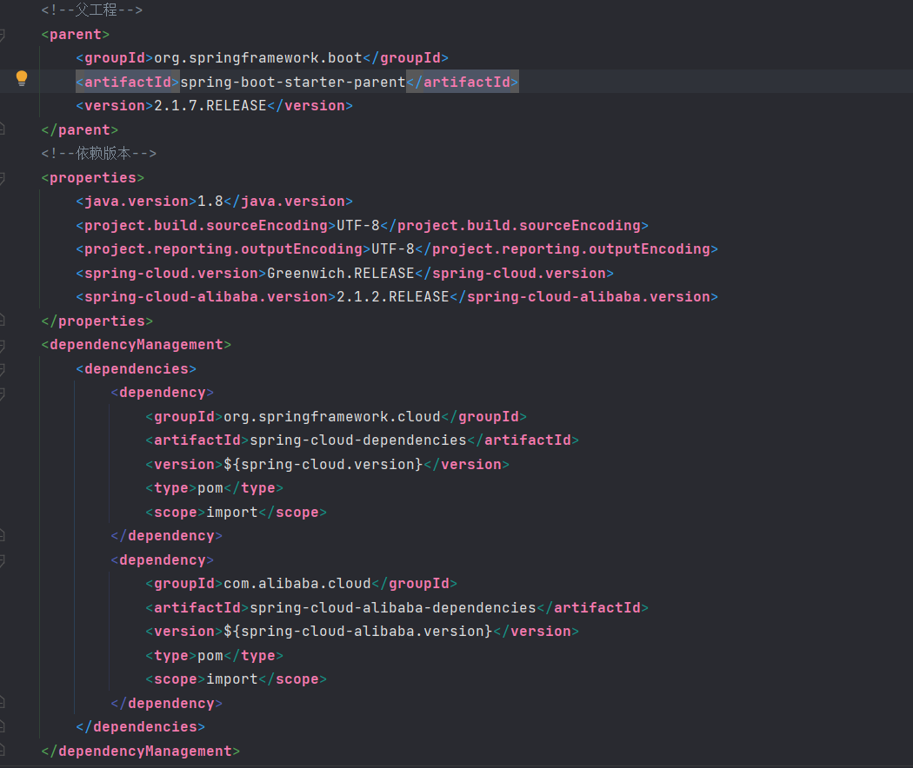
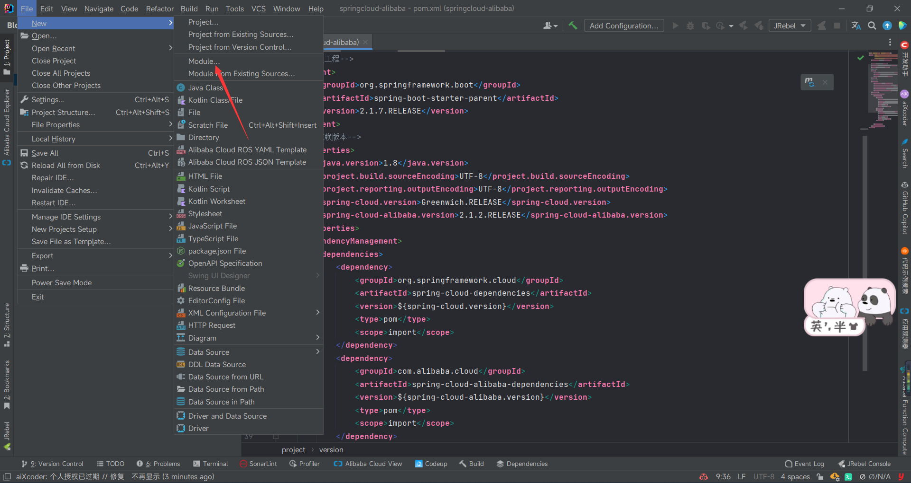
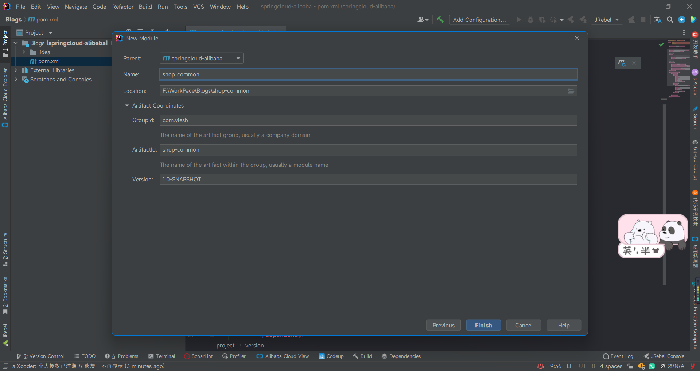
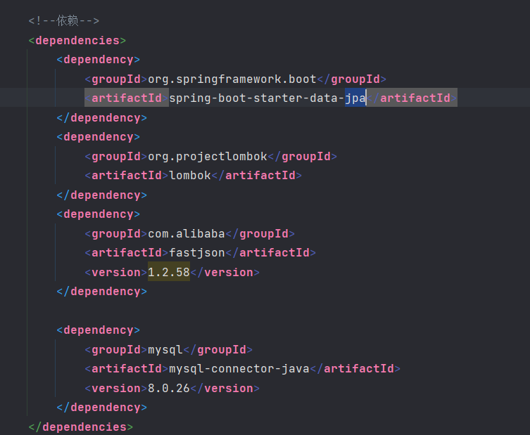
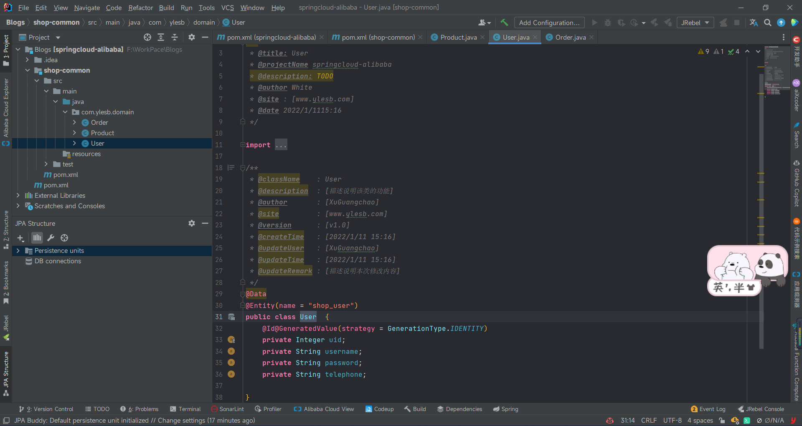

# 一、开发环境
JDK 1.8
SpringBoot 2.1.7.RELEASE
SpringCloud-Alibaba 2.1.2.RELEASE
数据库MySQL 5.8
如果需要修改版本请参照：[SpringCloud-Alibaba版本说明](https://github.com/alibaba/spring-cloud-alibaba/wiki/%E7%89%88%E6%9C%AC%E8%AF%B4%E6%98%8E)

其他所需环境随学习开发进度不断补充。
# 二、开发规范
分支命名：日期_姓名首字母缩写_功能单词，如：210804_xgc_buildFramework
提交规范：作者，type: desc 如：xgc，fix：修复查询用户信息逻辑问题 参考Commit message 规范

```js
# 主要type
feat:     增加新功能
fix:      修复bug

# 特殊type
docs:     只改动了文档相关的内容
style:    不影响代码含义的改动，例如去掉空格、改变缩进、增删分号
build:    构造工具的或者外部依赖的改动，例如webpack，npm
refactor: 代码重构时使用
revert:   执行git revert打印的message

# 暂不使用type
test:     添加测试或者修改现有测试
perf:     提高性能的改动
ci:       与CI（持续集成服务）有关的改动
chore:    不修改src或者test的其余修改，例如构建过程或辅助工具的变动

```

# 三、我们开始吧
首先创建SpringCloud-Alibaba Maven工程文件

选择新建文件
Maven工程
然后就是命名了
我们以springcloud-alibaba命名（自己随意起名也是可以的）

然后点击Finish


会看到如下工程目录
因为我们不需要父工程不需要写任何代码。我们可以吧src文件删除掉。
然后就是进行父工程SpringCloud-Alibaba一些相关依赖。


下一步我们创建公共部分。
在新建里面选择Module

下面就和创建Maven工程一样了。

在这里我们还是先添加项目相关依赖。

然后进行数据库实体类的创建。

这个我们一个springcloud的简单环境搭建就好了。
后期会在这个项目上不断添加，喜欢的请点个start~
项目源码参考一下分支220118_xgc_initProject
Gitee：https://gitee.com/coderxgc/springcloud-alibaba
GitHub：https://github.com/coderxgc/springcloud-alibaba